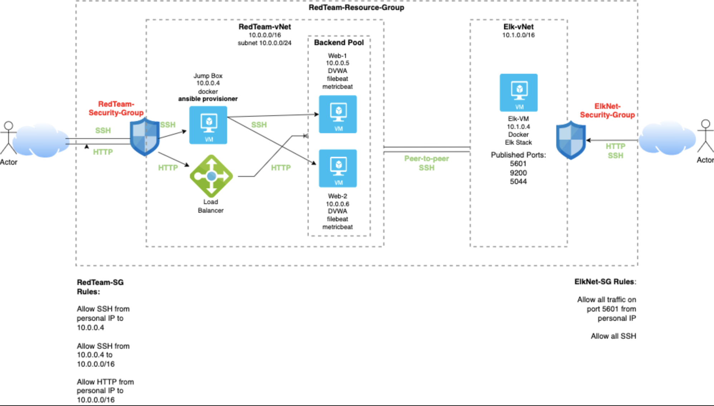
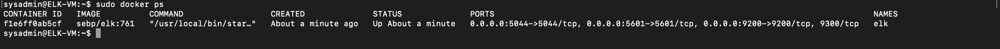

## Automated ELK Stack Deployment

- The files in this repository were used to configure the network depicted below.

 

- These files have been tested and used to generate a live ELK deployment on Azure. They can be used to either recreate the entire deployment pictured above. Alternatively, select portions of the install-elk.yml file may be used to install only certain pieces of it, such as Filebeat.

 

This document contains the following details:
- Description of the Topology
- Access Policies
- ELK Configuration
  - Beats in Use
  - Machines Being Monitored
- How to Use the Ansible Build

### Description of the Topology

- The main purpose of this network is to expose a load-balanced and monitored instance of DVWA, the D*mn Vulnerable Web Application.

  - Load balancing ensures that the application will be highly redundant, in addition to restricting access to the network.

- Integrating an ELK server allows users to easily monitor the vulnerable VMs for changes to the log files and system metrics.

- The configuration details of each machine may be found below:

| Name     | Function       | IP Address     | Operating System |
|----------|----------------|----------------|------------------|
| Jump-Box | Gateway        | 20.213.92.0    | Linux            |
| Web-1    | DVWA host      | 20.211.185.112 | Linux            |
| Web-2    | DVWA host      | 20.211.185.112 | Linux            |
| Elk-VM   | ELK-stack host | 52.189.197.243 | Linux            |

### Access Policies

- The machines on the internal network are not exposed to the public Internet. 

- Only the load balancer machine can accept connections from the Internet. Access to this machine is only allowed from the user's personal IP address.

- Machines within the network can only be accessed by Elk-VM.

- A summary of the access policies in place can be found in the table below:

| Name     | Publicly Accessible?   | IP Address     |
|----------|------------------------|----------------|
| Jump-Box | No                     | 20.213.92.0    |
| Web-1    | Yes, via Load Balancer | 20.211.185.112 |
| Web-2    | Yes, via Load Balancer | 20.211.185.112 |
| Elk-VM   | Yes                    | 52.189.197.243 |

### Elk Configuration

Ansible was used to automate configuration of the ELK machine; no configuration was performed manually. This kind of automation is advantageous because it reduces time and removes the opportunity for errors.

The playbook implements the following tasks:
- Install docker container
- Increase virtual memory
- Download and launch ELK stack

The following screenshot displays the result of running `docker ps` after successfully configuring the ELK instance.

### Target Machines & Beats
This ELK server is configured to monitor the following machines:
- 10.0.0.5
- 10.0.0.6

We have installed the following Beats on these machines:
- Filebeat
- Metricbeat

These Beats allow us to collect the following information from each machine:
- Filebeat collects system logs from a machine and allows a user to monitor for suspicious activity. Metricbeat periodically monitors system metrics to ensure a machine is running properly.  

### Using the Playbook
In order to use the playbook, you will need to have an Ansible control node already configured. Assuming you have such a control node provisioned: 

SSH into the control node and follow the steps below:
- Copy the elk-install.yml file to the /etc/ansible directory in the ansible container.
       cp elk-install.yml /etc/ansible
- Update the /etc/ansible/hosts file to include the IP address of the machine you are installing ELK on.
       nano /etc/ansible/hosts
- Run the playbook, and navigate to <20.211.185.112:5601/app/kibana> to check that the installation worked as expected.
       ansible-playbook /etc/ansible/elk-install.yml

